<div align="center">


<br/><br/>

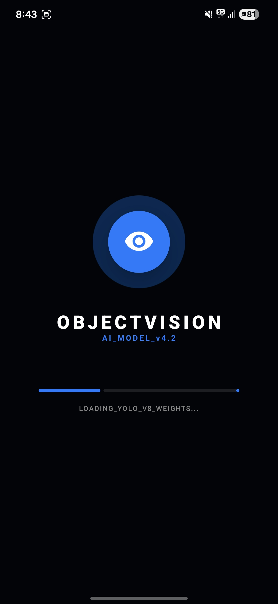

<br/><br/>

# 👁️ ObjectVision

### Real-time On-Device Object Detection & Smart Product Analysis

ObjectVision is a fully offline Android application powered by a **custom-trained YOLOv8 Nano model** that detects objects in real-time at **up to 60 FPS** with **94.5% accuracy** — and goes beyond detection by delivering **AI-powered nutritional and ingredient analysis** for recognized products.

> 🎓 B.Tech Final Year Project — ITM SLS Baroda University, 2026

<br/>

[🚀 Getting Started](#-getting-started) • [✨ Features](#-features) • [📸 Screenshots](#-screenshots) • [🛠️ Tech Stack](#%EF%B8%8F-tech-stack) • [🤖 AI Model](#-ai-model) • [👥 Team](#-team)

</div>

---

## ✨ Features

| Feature | Description |
|---|---|
| 🔍 **Real-Time Neural Scan** | Live camera detection at up to 60 FPS with green bounding boxes and confidence scores |
| 🧠 **Custom YOLOv8 Nano Model** | Trained on a proprietary product dataset — not generic COCO data |
| 📊 **Neural Analytics Dashboard** | Inference speed (avg. 212ms), total scans, CPU load, and 94.5% accuracy stats |
| 📋 **Detection Logs** | Full timestamped history of every detected object with confidence scores |
| 🥤 **AI Product Analysis** | Energy output, processing level, vegetarian/vegan status, and ingredient composition |
| 🧪 **Nutrition Facts** | Detailed carbs, fat, protein, sodium and allergen info per detected product |
| ⚙️ **System Configuration** | Toggle High Precision Mode, Offline Processing, Haptic Feedback, Battery Optimization |
| 🔒 **100% Offline** | All inference runs on-device — no internet, no data sent to the cloud |
| 🌙 **Dark UI** | Sleek dark theme built with Jetpack Compose for a modern, eye-friendly experience |
| ⚡ **Battery Smart** | Auto-reduces FPS when battery drops below 20% |

---

## 📸 Screenshots

<div align="center">

### Core Screens

<table>
  <tr>
    <td align="center"><b>🌅 Splash / Boot</b></td>
    <td align="center"><b>🔍 Neural Scan (Live)</b></td>
    <td align="center"><b>📊 Neural Analytics</b></td>
  </tr>
  <tr>
    <td></td>
    <td>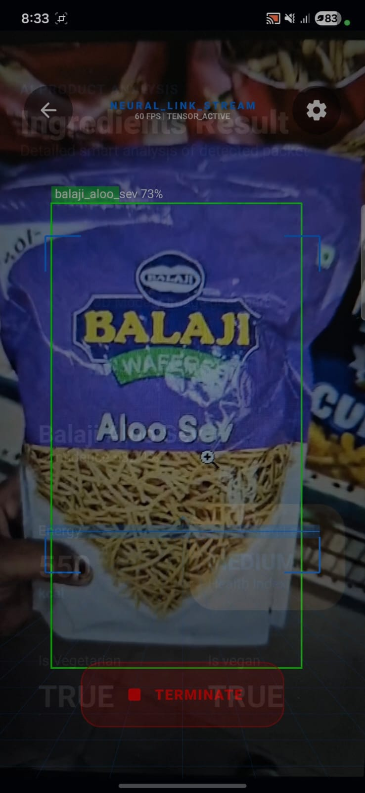</td>
    <td>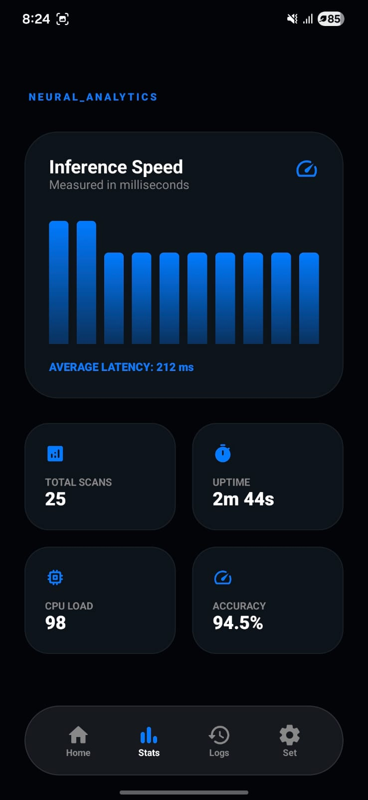</td>
  </tr>
  <tr>
    <td align="center"><b>📋 Detection Logs</b></td>
    <td align="center"><b>⚙️ System Config</b></td>
    <td></td>
  </tr>
  <tr>
    <td>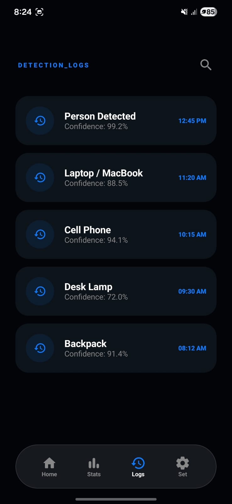</td>
    <td>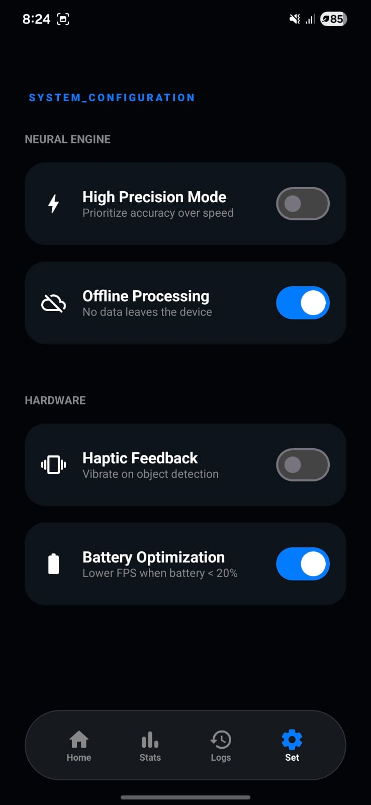</td>
    <td></td>
  </tr>
</table>

---

### 🥤 AI Product Analysis — Hell Energy Drink (92.2% confidence)

<table>
  <tr>
    <td align="center"><b>Product Analysis</b></td>
    <td align="center"><b>Ingredients Composition</b></td>
    <td align="center"><b>Nutrition & Allergens</b></td>
  </tr>
  <tr>
    <td>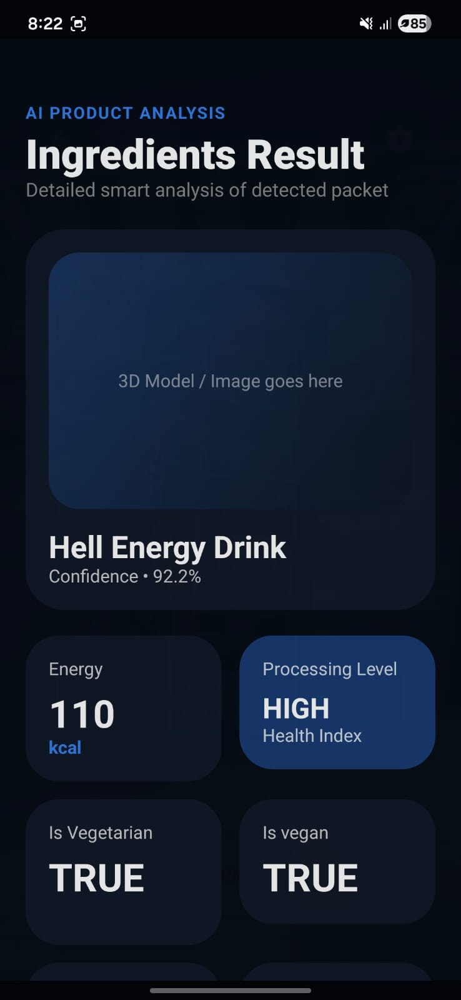</td>
    <td>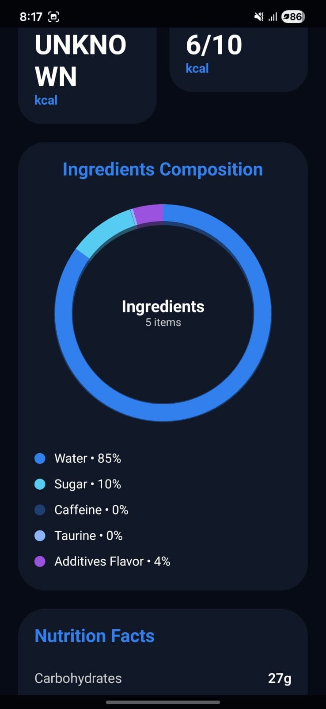</td>
    <td>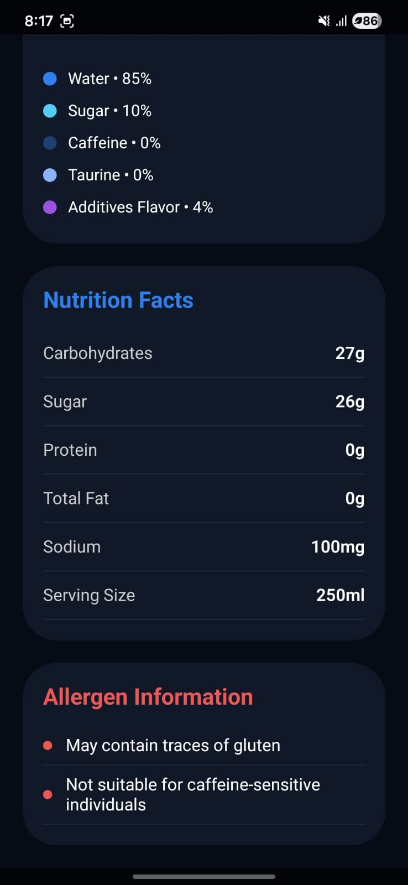</td>
  </tr>
</table>

---

### 🍟 AI Product Analysis — Balaji Aloo Sev (80.3% confidence)

<table>
  <tr>
    <td align="center"><b>Product Analysis</b></td>
    <td align="center"><b>Ingredients Composition</b></td>
    <td align="center"><b>Nutrition & Allergens</b></td>
  </tr>
  <tr>
    <td>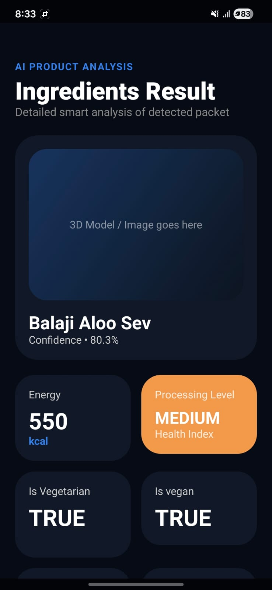</td>
    <td>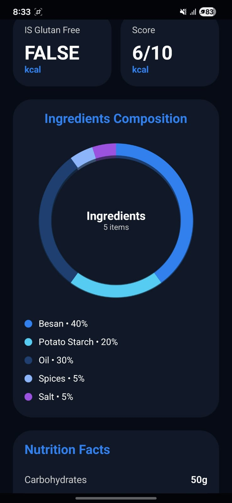</td>
    <td>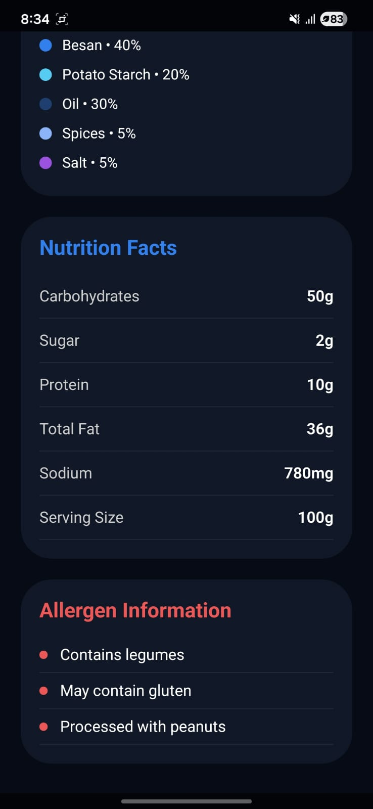</td>
  </tr>
</table>

</div>

---

## 🛠️ Tech Stack

```
├── Language        →  Kotlin (100%)
├── UI Framework    →  Jetpack Compose
├── AI Model        →  YOLOv8 Nano (custom-trained, Ultralytics)
├── Model Training  →  Python + PyTorch
├── Runtime         →  TFLite / ONNX (on-device inference)
├── Build System    →  Gradle (Kotlin DSL)
├── Architecture    →  MVVM + Jetpack Compose state management
└── Platform        →  Android 8.0+ (Oreo and above)
```

**Key Tools & Libraries:**
- 🤖 **YOLOv8 Nano** — Ultra-lightweight YOLO variant optimized for mobile edge computing
- 📱 **Jetpack Compose** — Declarative, reactive Android UI with smooth camera frames
- ⚙️ **TFLite Runtime** — Fast on-device neural network inference
- 🔬 **Custom Dataset** — Proprietary annotated product image dataset
- 🧱 **Kotlin Coroutines** — Non-blocking camera and inference threading

---

## 🤖 AI Model

### Technical Pipeline

```
Camera Input
    ↓
Frame Preprocessing
    ↓
YOLOv8 Nano Model (TFLite)
    ↓
Bounding Box Detection
    ↓
Confidence Score Filtering
    ↓
Product Data Mapping
    ↓
Jetpack Compose UI Rendering
```

### Performance Benchmarks

| Metric | Value |
|---|---|
| 🎯 Detection Accuracy | **94.5%** on custom dataset |
| ⚡ Avg. Inference Latency | **~212 ms** |
| 🎬 Max Frame Rate | **60 FPS** |
| 📦 Model | YOLOv8 Nano (AI_MODEL_v4.2) |
| 🌐 Internet Required | **None — fully offline** |

---

## 📁 Project Structure

```
ObjectDetection_system/
│
├── app/
│   └── src/
│       ├── main/
│       │   ├── java/          # Kotlin source (Activities, ViewModels, Composables)
│       │   │   ├── screens/   # Neural Scan, Analytics, Logs, Settings, Analysis
│       │   │   ├── model/     # Data classes (ScanSession, ProductData, Settings)
│       │   │   └── inference/ # YOLOv8 TFLite inference engine
│       │   ├── assets/        # YOLOv8 .tflite model weights + product database
│       │   ├── res/           # Layouts, drawables, strings
│       │   └── AndroidManifest.xml
│
├── build.gradle.kts           # Root Gradle config
├── settings.gradle.kts        # Project settings
└── gradle.properties
```

---

## 🚀 Getting Started

### Prerequisites

- ✅ Android Studio (Hedgehog or later)
- ✅ JDK 11 or above
- ✅ Android device / emulator running **Android 8.0+**
- ✅ Minimum **3 GB RAM** recommended for smooth inference
- ✅ Device with NPU or GPU preferred for optimal performance

### Installation

**1. Clone the repository**
```bash
git clone https://github.com/Hemanshu4949/ObjectDetection_system.git
cd ObjectDetection_system
```

**2. Open in Android Studio**
```
File → Open → Select the cloned folder
```

**3. Add the YOLOv8 model weights**

Place your `yolov8_model.tflite` file in:
```
app/src/main/assets/
```

**4. Sync Gradle & Run**
```
Sync Gradle → Run on Device or Emulator
```

> ⚠️ A physical device is **strongly recommended** — the camera inference pipeline performs significantly better on real hardware than an emulator.

### Building the Model (optional)

If you want to retrain the model on your own dataset:

```bash
# Install Ultralytics
pip install ultralytics

# Train YOLOv8 Nano
yolo task=detect mode=train model=yolov8n.pt data=your_dataset.yaml epochs=100 imgsz=640

# Export to TFLite
yolo export model=best.pt format=tflite
```

---

## 🔧 System Configuration Options

| Setting | Description | Default |
|---|---|---|
| ⚡ High Precision Mode | Prioritize accuracy over speed | OFF |
| ☁️ Offline Processing | No data leaves the device | ON |
| 📳 Haptic Feedback | Vibrate on each object detection | OFF |
| 🔋 Battery Optimization | Lower FPS when battery < 20% | ON |

---

## ⚠️ Challenges & Solutions

| Challenge | Solution |
|---|---|
| **Dataset Creation** | Manually collected and annotated a custom product image dataset |
| **Mobile Optimization** | Chose YOLOv8 Nano for the best accuracy-speed tradeoff on mobile |
| **Real-Time Processing** | Used Kotlin Coroutines + non-blocking Compose updates to maintain 60 FPS |
| **Model Deployment** | Optimized PyTorch → TFLite conversion to minimize precision loss |

---

## 🔮 Future Scope

- 📲 Barcode and QR code scanning for extended product databases
- 🗃️ Expanded custom dataset for more product categories
- ⌚ Wearable device integration
- 🎙️ Voice assistant support for accessibility

---

## 🏗️ Architecture & SDLC

Follows the **Agile Iterative SDLC Model**, enabling continuous improvements across:
- AI model accuracy iteration
- UI/UX enhancement cycles
- Performance benchmarking sprints

---

## 🤝 Contributing

```bash
git checkout -b feature/your-feature-name
git commit -m "Add: your feature description"
git push origin feature/your-feature-name
# Open a Pull Request 🎉
```

---

## 👥 Team

| Name | Roll No. | Role |
|---|---|---|
| **Hemanshu Sojitra** | 24C21551 | Developer |
| **Samiha Vohra** | 24C21556 | Developer |
| **Tejas Solanki** | 23C25016 | Developer |

**Project Guide:** Mr. Meet Pandya
**Institution:** ITM SLS Baroda University — Dept. of CS & IT, 2026

---

<div align="center">

⭐ If you found this project helpful, give it a star!

Made with ❤️ using Kotlin, Jetpack Compose & YOLOv8

</div>
